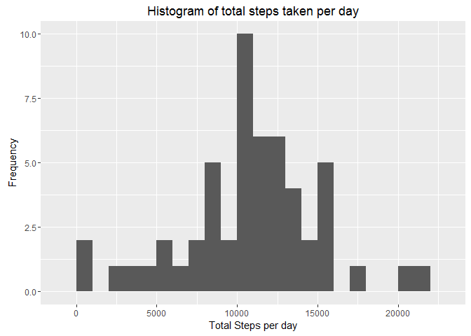
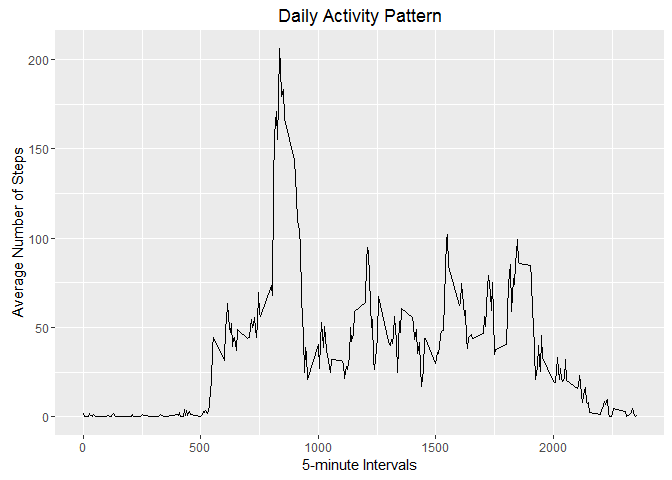
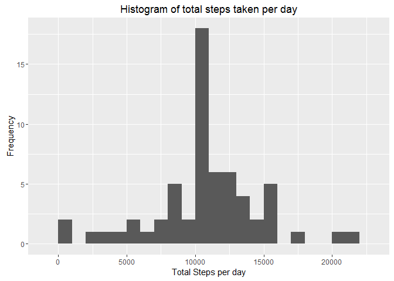
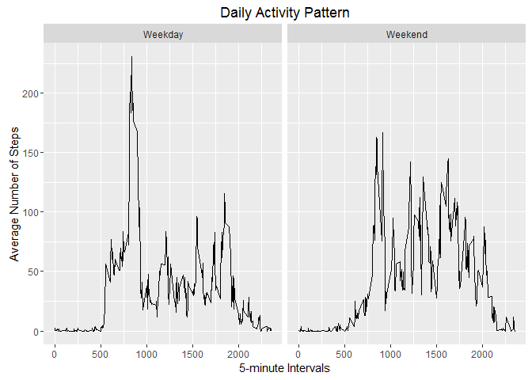

# Reproducible Research: Peer Assessment 1


## Loading and preprocessing the data


```r
activity<-read.csv("activity.csv")
summary(activity)
```

```
##      steps                date          interval     
##  Min.   :  0.00   2012-10-01:  288   Min.   :   0.0  
##  1st Qu.:  0.00   2012-10-02:  288   1st Qu.: 588.8  
##  Median :  0.00   2012-10-03:  288   Median :1177.5  
##  Mean   : 37.38   2012-10-04:  288   Mean   :1177.5  
##  3rd Qu.: 12.00   2012-10-05:  288   3rd Qu.:1766.2  
##  Max.   :806.00   2012-10-06:  288   Max.   :2355.0  
##  NA's   :2304     (Other)   :15840
```


## What is mean total number of steps taken per day?


```r
library(ggplot2)
stepsperday<-split(activity[[1]],activity[[2]])
totperday<-sapply(stepsperday,sum)
data<-data.frame(totperday)
hist<-ggplot(data,aes(totperday))
hist+geom_histogram(binwidth = 1000,na.rm = TRUE)+xlab("Total Steps per day")+ylab("Frequency")+ggtitle("Histogram of total steps taken per day")
```

 

```r
# The mean total number of steps taken per day :- 
mean(totperday,na.rm = TRUE)
```

```
## [1] 10766.19
```

```r
# The median total number of steps taken per day is :-

median(totperday,na.rm = TRUE)
```

```
## [1] 10765
```


## What is the average daily activity pattern?


```r
library(ggplot2)
stepsperinterval<-split(activity[[1]],activity[[3]])
avgstepsperinterval<-sapply(stepsperinterval,mean,na.rm=TRUE)
data<-data.frame(interval=unique(activity[[3]]),avgstepsperinterval)
plot<-ggplot(data,aes(interval,avgstepsperinterval))
plot+ geom_line()+xlab("5-minute Intervals")+ylab("Average Number of Steps")+ggtitle("Daily Activity Pattern")
```

 

```r
# 5-minute Interval with maximum average number of steps :-
  
avgstepsperinterval[[which.max(avgstepsperinterval)[[1]]]]
```

```
## [1] 206.1698
```

## Imputing missing values


```r
library(ggplot2)
# Total number of rows with missing values

sum(is.na(activity[[1]]))
```

```
## [1] 2304
```

```r
# Making a new dataset by filling in the missing values based on the average number of steps taken in that Interval, averaged over all the days.
steps<-numeric()
for(i in 1:nrow(activity))
{
steps[i]<-round(ifelse(is.na(activity[i,1])==TRUE,avgstepsperinterval[[ifelse(i%%288!=0,i%%288,288)]],activity[i,1]))
}
new_activity<-data.frame(steps,date = activity[[2]],interval=activity[[3]])
stepsperday<-split(new_activity[[1]],new_activity[[2]])
totperday<-sapply(stepsperday,sum)
data<-data.frame(totperday)
hist<-ggplot(data,aes(totperday))
hist+geom_histogram(binwidth = 1000,na.rm = TRUE)+xlab("Total Steps per day")+ylab("Frequency")+ggtitle("Histogram of total steps taken per day")
```

 

```r
# The mean total number of steps taken per day :- 
mean(totperday,na.rm = TRUE)
```

```
## [1] 10765.64
```

```r
# The median total number of steps taken per day is :-

median(totperday,na.rm = TRUE)
```

```
## [1] 10762
```
<br>
<br>

####As can be seen that the mean and median of the total number of steps per day differ very slightly though this difference might be of very less significance.

####Also from the grapgh it can be seen that the total steps per day changes , especially for days with larger number of total steps.


## Are there differences in activity patterns between weekdays and weekends?


```r
day<-weekdays(as.POSIXlt(new_activity[[2]]))
daytype<-ifelse(day!="Saturday" & day!="Sunday","Weekday","Weekend")
new_activity_dtype<-data.frame(new_activity,daytype)
daydata<-split(new_activity_dtype,new_activity_dtype[[4]])
stepsperintervalweekday<-split(daydata[[1]][[1]],daydata[[1]][[3]])
stepsperintervalweekend<-split(daydata[[2]][[1]],daydata[[2]][[3]])

avgstepsperintervalweekday<-sapply(stepsperintervalweekday,mean)
avgstepsperintervalweekend<-sapply(stepsperintervalweekend,mean)
dataweekday<-data.frame(interval=unique(new_activity_dtype[[3]]),avgstepsperinterval=avgstepsperintervalweekday,daytype=rep("Weekday",length(unique(new_activity_dtype[[3]]))))
dataweekend<-data.frame(interval=unique(new_activity_dtype[[3]]),avgstepsperinterval=avgstepsperintervalweekend,daytype=rep("Weekend",length(unique(new_activity_dtype[[3]]))))
data<-rbind(dataweekday,dataweekend)
plot<-ggplot(data,aes(interval,avgstepsperinterval))
plot+ geom_line()+facet_grid(.~daytype)+xlab("5-minute Intervals")+ylab("Average Number of Steps")+ggtitle("Daily Activity Pattern")
```

 
